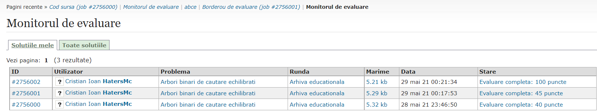

# Simple-Skip-List
RO: Aceasta este o implemenatre de Skip List inspirata de implementarea celor de la GeeksForGeeks (https://www.geeksforgeeks.org/skip-list-set-2-insertion/)

In cadrul repo-ului exista si un folder abce care contine toata rezolvarea problemei abce de pe infoarena(https://www.infoarena.ro/problema/abce)

